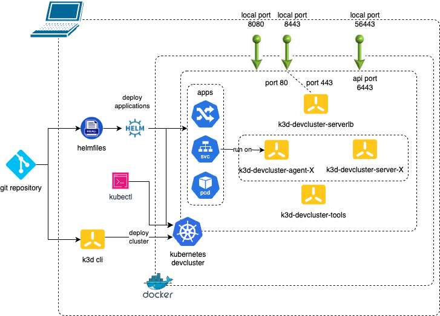

# stack for developing applications on Kube

Provides an application development stack on Kubernetes

Can be used to develop and run your app on kubernetes

Requirements:
- must run for local development or CI
- simple to use
- start and destroy quickly
- developers working on machines with limited resources or need to conserve system resources for other tasks.
- low memory requirements and low resources consumption
- dev/prod parity
- support common kubernetes features
- makes it easy to create single or multi-node cluster
- backed on already known docker

Work on:
- Linux
- Mac (and M1 too)

The stack is based on:
- docker (must be installed)
- kubectl
- k3d
  - k3s a lightweight wrapper to run k3s kubernetes cluster
- helmfile
  - helm
  - helm-diff: Preview helm upgrade changes as a diff
  - helm-git: Get non-packaged Charts directly from Git.
  - helm-s3: Provides S3 protocol support for charts and repos.
  - helm-secrets: This plugin provides secrets values encryption for Helm charts secure storing

Steps:
1. install dependencies 
2. Create local kubernetes cluster
3. Deploy your applications



## Quick Usage

Requirements: must be installed
- Internet access
- curl
- docker > v20.10.5 (see  https://k3d.io/v5.6.0/#requirements)

1. first install all requirements (k3d,helmfile,..), using the script:
```
scripts/install_prereq.sh
```

2. Then, deploy local dev cluster and all ressources, with the script :
```
scripts/deploy_all.sh
```

3. Develop your app, test, have fun !

4. At the end, destroy all ressources and local cluster. That's all folks
```
scripts/destroy_all.sh
```

## Versions

Default versions:
- docker: > v20.10.5
- kubectl: 1.29.2
- k3d : v5.6.0 - [k3d release](https://github.com/k3d-io/k3d/releases)
  - k3s: 1.27.4-k3s1
    - See Embedded Component Versions section in [k3s release](https://github.com/k3s-io/k3s/releases/tag/v1.27.4%2Bk3s1)
    - kubernetes: v1.27.4
- helmfile: 0.162.0 - [helmfile release](https://github.com/helmfile/helmfile/releases/tag/v0.162.0)
  - See version in [helmfile version](https://github.com/helmfile/helmfile/blob/main/pkg/app/init.go#L19)
  - helm: v3.14.1
  - helm-diff: v3.9.4
  - helm-git: v0.12.0
  - helm-s3: v0.14.0
  - helm-secrets: v4.1.1

To override versions , set following env variables before running `scripts/install_prereq.sh`
```bash
# example
export KUBECTL_VERSION="v1.29.2"
export K3D_VERSION="v5.6.0"
export HELMFILE_VERSION="0.162.0"
export FORCE_INSTALL=true
scripts/install_prereq.sh
```

## Details

In following directories:
- scripts: script to install prereq, deploy/destroy all ressources
- k3d: configuration file to create/use/destroy local kubernetes cluster
- helmfile.yaml: applications configurations inventory to deploy
- applications: helmfile application to deploy on kube cluster
- demo files:
  - helm: sample whoami demo helm charts
  - manifests: to install simple manifests (for demo)
